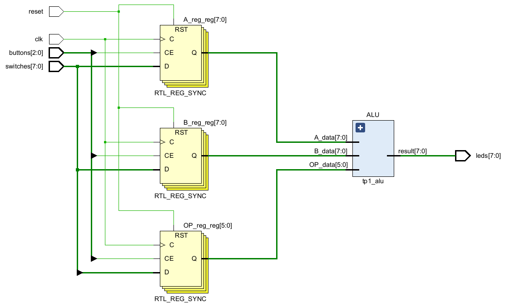
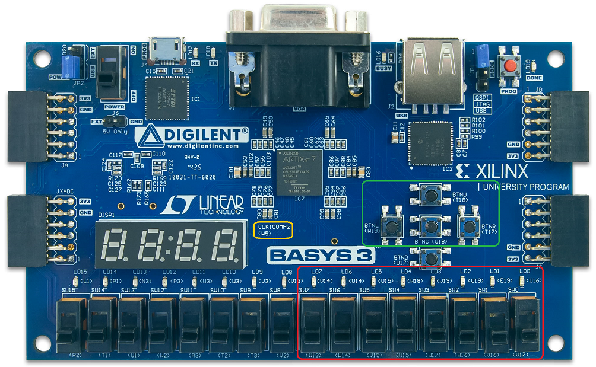
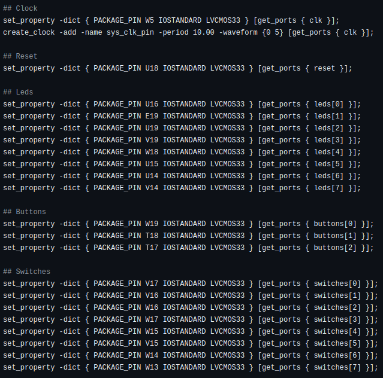

# TP1: ALU

### Asignatura: Arquitectura de Computadoras

**Facultad de Ciencias Exactas, Físicas y Naturales (UNC)**

---

* **Grupo:** Veriverilady
* **Profesor:** Martin Pereyra

---

### Integrantes y Contacto

| Nombre y Apellido | Correo Electrónico |
| :--- | :--- |
| **Enzo L. Laura Surco** | _enzo.laura.surco@mi.unc.edu.ar_ |
| **Saqib D. Mohammad Cabrejos** | _saqib.mohammad@mi.unc.edu.ar_ |

## Resumen

En este trabajo práctico se diseñó una Unidad Lógica Aritmética (ALU) combinacional en Verilog, parametrizable en el ancho del bus de datos e integrada en una placa Basys 3. El sistema permite ingresar dos operandos y el código de operación mediante los switches de la placa, almacenarlos utilizando tres pulsadores y observar el resultado sobre ocho LEDs.

El diseño está formado por el módulo [`tp1_alu`](./TP1_ALU/TP1_ALU.srcs/sources_1/new/tp1_alu.v), que implementa las operaciones aritméticas y lógicas, y el módulo [`top_module`](./TP1_ALU/TP1_ALU.srcs/sources_1/new/top_module.v), que conecta la ALU con los recursos físicos de la FPGA. La verificación se realiza mediante el banco de pruebas [`test_bench`](./TP1_ALU/TP1_ALU.srcs/sim_1/new/test_bench.v).

## Objetivos

Los objetivos del trabajo son:

- Desarrollar una ALU combinacional capaz de ejecutar ocho operaciones.
- Parametrizar el ancho del bus de datos y del código de operación.
- Integrar la ALU con switches, pulsadores y LEDs mediante un módulo top.
- Definir el mapeo físico y la restricción de un clock de 100 MHz para una Basys 3.
- Verificar el comportamiento del sistema mediante simulación en Vivado.

## Especificación funcional

La configuración utilizada posee operandos y resultados de ocho bits (`NB_DATA = 8`) y un código de operación de seis bits (`NB_OPCODE = 6`).

| Operación | Opcode | Expresión implementada | Descripción |
| :---: | :---: | :--- | :--- |
| ADD | `100000` | `A_data + B_data` | Suma de los operandos. |
| SUB | `100010` | `A_data - B_data` | Resta de B a A. |
| AND | `100100` | `A_data & B_data` | AND bit a bit. |
| OR | `100101` | <code>A_data &#124; B_data</code> | OR bit a bit. |
| XOR | `100110` | `A_data ^ B_data` | XOR bit a bit. |
| SRA | `000011` | `$signed(A_data) >>> B_data` | Desplazamiento aritmético a derecha. |
| SRL | `000010` | `A_data >> B_data` | Desplazamiento lógico a derecha. |
| NOR | `100111` | <code>~(A_data &#124; B_data)</code> | NOR bit a bit. |

El resultado conserva únicamente los ocho bits definidos por `NB_DATA`. Por lo tanto, una suma con acarreo o una resta con desbordamiento se representa módulo 2 elevado a `NB_DATA`. La ALU no genera flags de carry, overflow, cero o signo.

Cuando el opcode no coincide con ninguna operación válida, la salida toma el valor cero.

## Arquitectura del sistema

El mismo bus de ocho switches se reutiliza para ingresar los dos operandos y la operación. Cada valor se almacena en un registro diferente mediante un pulsador. Los registros alimentan permanentemente a la ALU y el resultado combinacional se conecta a los LEDs.

<p align="center">
    <br>
    <em>Fig 2. Switches, leds, pulsadores y clock utilizados.</em>
</p>


## Módulo ALU

El módulo `tp1_alu` posee los siguientes parámetros:

| Parámetro | Valor predeterminado | Función |
| :--- | :---: | :--- |
| `NB_DATA` | 8 | Ancho de los operandos y del resultado. |
| `NB_OPCODE` | 6 | Ancho del código de operación. |

Sus puertos son:

| Puerto | Dirección | Ancho | Función |
| :--- | :---: | :---: | :--- |
| `A_data` | Entrada | `NB_DATA` | Primer operando. |
| `B_data` | Entrada | `NB_DATA` | Segundo operando o cantidad de desplazamiento. |
| `OP_data` | Entrada | `NB_OPCODE` | Código de la operación. |
| `result` | Salida | `NB_DATA` | Resultado de la ALU. |

La lógica se encuentra dentro de un bloque combinacional `always @(*)`, por lo que cualquier modificación de sus entradas provoca una nueva evaluación del resultado. Dentro del bloque se utilizan asignaciones bloqueantes, adecuadas para describir lógica combinacional. Al comienzo se asigna cero a `result`; luego, una cadena `if/else if` selecciona la operación correspondiente a `OP_data`.

En SRA se utiliza `$signed(A_data)` por lo que el bit más significativo de A se interpreta como el bit de signo y se replica durante su desplazamiento.

## Módulo TOP

El módulo `top_module` integra la interfaz física con la ALU. Sus parámetros predeterminados son `NB_DATA = 8`, `NB_OPCODE = 6` y `NB_BUTTON = 3`.

Internamente contiene tres registros:

- `A_reg`, que almacena el primer operando.
- `B_reg`, que almacena el segundo operando.
- `OP_reg`, que almacena el opcode.

Los registros se actualizan en el flanco ascendente de `clk` mediante asignaciones no bloqueantes. El reset es síncrono y tiene prioridad sobre los pulsadores `if/else`, por lo que debe permanecer activo durante al menos un flanco ascendente para inicializar los tres registros en cero.

### Secuencia de uso

1. Activar el reset para inicializar los registros.
2. Configurar el primer operando en `switches[7:0]` y presionar `buttons[0]`.
3. Configurar el segundo operando y presionar `buttons[1]`.
4. Configurar el opcode en `switches[5:0]` y presionar `buttons[2]`.
5. Leer el resultado binario en `leds[7:0]`.

Al cargar el opcode sólo se utilizan los seis switches menos significativos. Los switches 6 y 7 no intervienen en esta carga.

<p align="center">
    <br>
    <em>Fig 2. Switches, leds, pulsadores y clock utilizados.</em>
</p>

## Constraints e implementación en FPGA

El archivo [`constrains.xdc`](./TP1_ALU/TP1_ALU.srcs/constrains/new/constrains.xdc) asocia los puertos lógicos de `top_module` con los pines físicos de la Basys 3. Todas las entradas y salidas entregan un voltaje constante de 3.3V `LVCMOS33`.

### Clock y botones

| Señal lógica | Pin | Recurso de la placa | Función |
| :--- | :---: | :--- | :--- |
| `clk` | W5 | Clock de 100 MHz | Sincronización del módulo top. |
| `reset` | U18 | Botón central | Reset síncrono. |
| `buttons[0]` | W19 | Botón izquierdo | Carga de A. |
| `buttons[1]` | T18 | Botón superior | Carga de B. |
| `buttons[2]` | T17 | Botón derecho | Carga del opcode. |

La restricción

```tcl
create_clock -add -name sys_clk_pin -period 10.00 -waveform {0 5} [get_ports { clk }]
```

describe un clock con período de 10 ns, equivalente a 100 MHz, y un ciclo de trabajo del 50 %.

### Switches y LEDs

| Bit | Switch | LED |
| :---: | :---: | :---: |
| 0 | V17 | U16 |
| 1 | V16 | E19 |
| 2 | W16 | U19 |
| 3 | W17 | V19 |
| 4 | W15 | W18 |
| 5 | V15 | U15 |
| 6 | W14 | U14 |
| 7 | W13 | V14 |

<p align="center">
    <br>
    <em>Fig 3. Configuración de Constraints.</em>
</p>

## Testbench

El testbench instancia `top_module`, de modo que verifica tanto las operaciones de la ALU como el mecanismo empleado para cargar sus entradas. El clock se genera alternando la señal cada 5 ns, lo que produce el mismo período de 10 ns indicado en los constraints.

La task `run_test` recibe el opcode, los dos operandos y el resultado esperado. Para cada prueba realiza las siguientes acciones:

1. Coloca A en los switches y activa `buttons[0]` durante 10 ns.
2. Coloca B en los switches y activa `buttons[1]` durante 10 ns.
3. Coloca el opcode en los switches y activa `buttons[2]` durante 10 ns.
4. Espera la propagación del resultado.
5. Compara `leds` con `expected` utilizando igualdad exacta (`===`).
6. Muestra `OK` o `ERROR` en la consola de Vivado.

Se prueban ADD, SUB, AND, OR, XOR, SRA, SRL y NOR. La cantidad de casos aleatorios por operación está controlada por `NUM_TESTS`.

La diferencia temporal entre el resultado `expected` y la salida `leds` que puede observarse en la forma de onda es parte de la secuencia de estímulos: `expected` se calcula antes de cargar los registros, mientras que `leds` cambia cuando A, B y, finalmente, el opcode fueron capturados por el módulo top.

### Criterio de verificación

Una prueba se considera exitosa cuando `leds` coincide bit a bit con `expected`. Para documentar el resultado completo, la simulación debe mostrar una comparación exitosa para cada una de las ocho operaciones y no debe contener mensajes `ERROR`.

Para ver mas detalles sobre las pruebas de ejecución y salidas por consola: **[Testbench-TP1](Testbench-TP1.md)**


## Consideraciones y limitaciones

- Los opcodes están definidos explícitamente con seis bits; por ello, aunque `NB_OPCODE` sea un parámetro, la configuración funcional utilizada es de seis bits.
- El valor completo de B actúa como cantidad de desplazamiento. Si es mayor o igual que `NB_DATA`, SRL completa el resultado con ceros y SRA con el bit de signo.
- El testbench actual ejecuta un caso aleatorio por operación. Para una verificación más exhaustiva se puede aumentar `NUM_TESTS` y agregar casos dirigidos de cero, máximo y minimo valor, overflow, y desplazamientos por cero y siete posiciones, aunque las mismas ya fueron verificadas fisicamente con éxito con la placa Basys 3.
- No se generan indicadores adicionales de carry, overflow, cero o negativo por criterio de diseño del modulo ALU.
