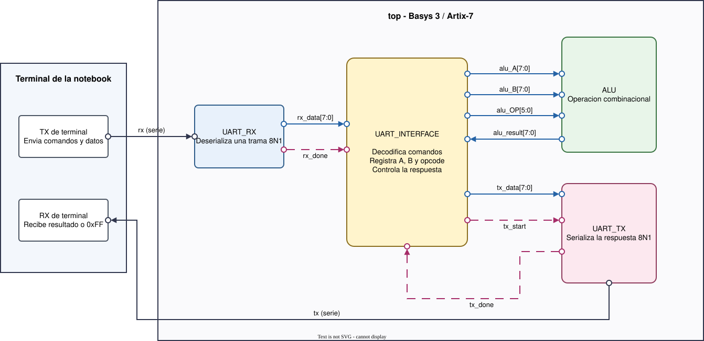
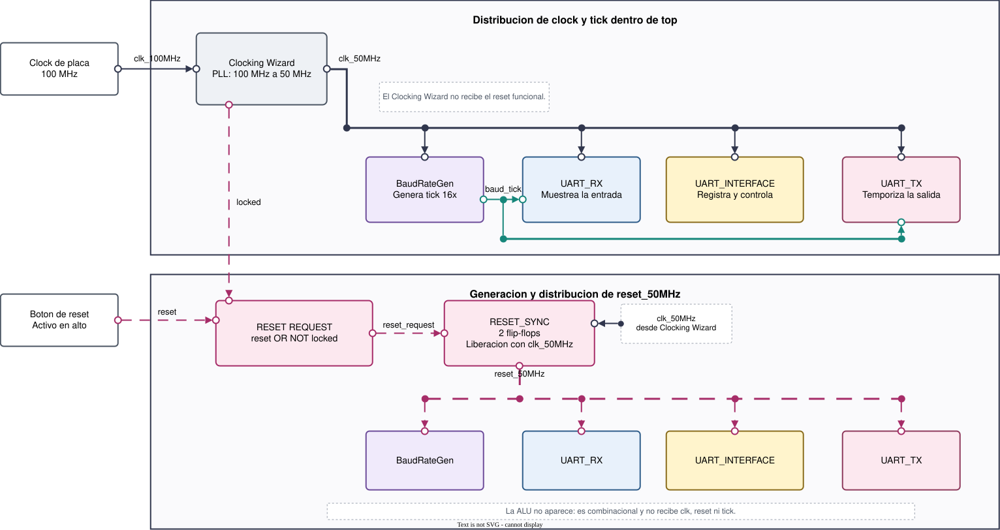
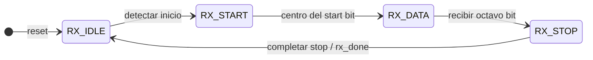
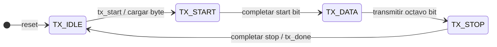
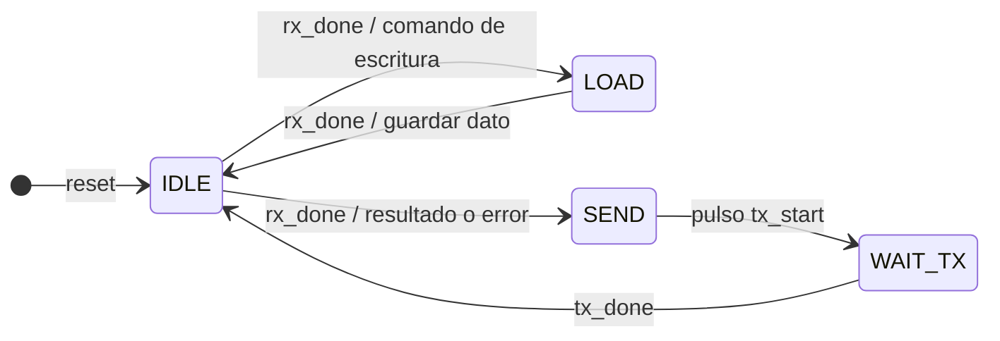
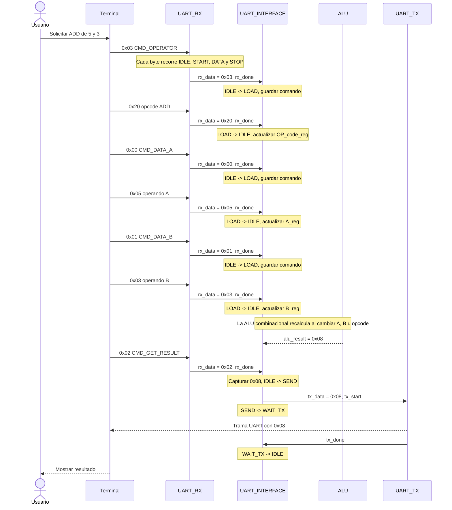
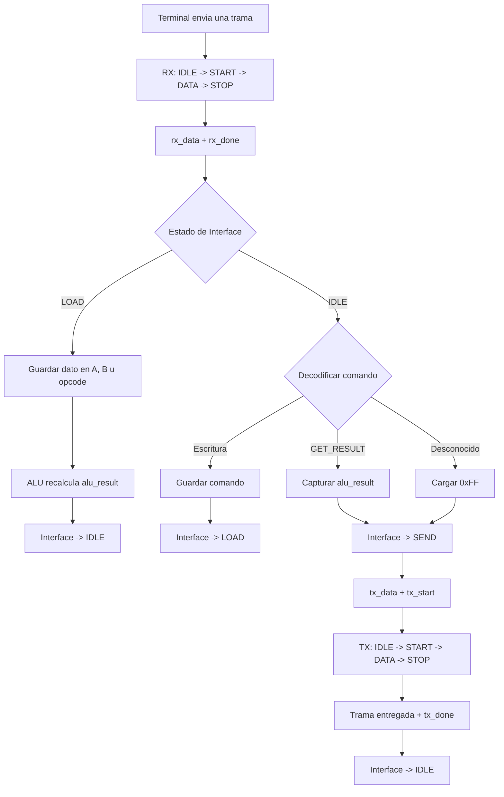

# Veriverilady

El Proyecto integra una ALU con
comunicacion UART sobre una placa Basys 3 con FPGA Artix-7. Una terminal escribe
los operandos y el codigo de operacion mediante comandos, solicita el resultado
y recibe la respuesta por el mismo enlace UART.

## Arquitectura implementada

La comunicacion utiliza un protocolo de comandos sobre tramas UART 8N1. Cada
byte recibido por `uart_rx` llega a `uart_interface` junto con un pulso
`rx_done`. La interface interpreta primero un comando y, cuando corresponde,
espera un segundo byte con el dato asociado.

| Comando | Valor | Byte siguiente | Efecto | Respuesta |
| --- | ---: | --- | --- | --- |
| `CMD_DATA_A` | `0x00` | Operando A de 8 bits | Actualiza el registro A. | Ninguna |
| `CMD_DATA_B` | `0x01` | Operando B de 8 bits | Actualiza el registro B. | Ninguna |
| `CMD_GET_RESULT` | `0x02` | No requiere | Captura el resultado combinacional actual. | Resultado de 8 bits |
| `CMD_OPERATOR` | `0x03` | Opcode de 8 bits | Conserva los 6 bits inferiores en el registro de operacion. | Ninguna |
| Comando desconocido | Otro valor | No requiere | Prepara el codigo de error. | `0xFF` |

Los comandos de escritura pueden enviarse en cualquier orden porque A, B y el
opcode se almacenan en registros independientes. Sus valores permanecen
vigentes hasta que otro comando los reemplaza o se activa `reset`. Por ejemplo,
la operacion ADD entre 5 y 3 utilizada por el testbench de integracion sigue esta
secuencia:

```text
Terminal -> FPGA: 0x03 0x20   Cargar opcode ADD
Terminal -> FPGA: 0x00 0x05   Cargar A = 5
Terminal -> FPGA: 0x01 0x03   Cargar B = 3
Terminal -> FPGA: 0x02        Solicitar resultado
FPGA -> Terminal: 0x08        Resultado
```

Los comandos de escritura no generan confirmacion. La interface solamente
activa UART TX al recibir `CMD_GET_RESULT` o un comando desconocido. Mientras
espera que termine esa respuesta no acepta otro byte, por lo que el protocolo
mantiene una unica transaccion de salida pendiente y no utiliza FIFO ni timeout
en hardware.

Un comando desconocido pertenece al protocolo y produce `0xFF`. En cambio, un
opcode no implementado pertenece a la ALU: su salida predeterminada es cero y
ese valor se devuelve cuando posteriormente se solicita el resultado.

## Diagramas de bloques

El camino funcional y la distribucion temporal se muestran por separado para
evitar cruces entre señales que cumplen objetivos diferentes.

### Camino de datos y control



[Fuente editable en Draw.io](docs/diagrams/uart_alu_data_control.drawio)

Las lineas azules continuas representan datos o buses. Las lineas magenta
discontinuas representan pulsos de control. Cada señal posee un puerto separado
y las flechas indican su direccion.

### Distribucion de clock, reset y tick



[Fuente editable en Draw.io](docs/diagrams/uart_clock_reset_tick.drawio)

La ALU no aparece en el segundo diagrama porque es combinacional: no recibe
`clk`, `reset` ni `tick`.

### Responsabilidad de cada modulo

| Modulo | Responsabilidad | Tiene FSM |
| --- | --- | --- |
| `clk_wiz_0` | Convierte el clock de 100 MHz de la placa en el clock interno de 50 MHz. | No; es un IP generado mediante Clocking Wizard de Vivado. |
| `baud_rate_gen` | Divide el clock de 50 MHz para generar `tick`, utilizado como habilitacion de sobremuestreo por RX y TX. | No; utiliza un contador. |
| `uart_rx` | Sincroniza la entrada asincrona, detecta una trama 8N1 y reconstruye un byte. | Si: `IDLE`, `START`, `DATA`, `STOP`. |
| `uart_interface` | Decodifica comandos, registra A, B y opcode, captura el resultado o codigo de error y controla el inicio de TX. | Si: `IDLE`, `LOAD`, `SEND`, `WAIT_TX`. |
| `alu` | Calcula el resultado a partir de A, B y opcode. | No; es combinacional. |
| `uart_tx` | Captura un byte y lo convierte en una trama UART 8N1. | Si: `IDLE`, `START`, `DATA`, `STOP`. |
| `fsm_generic` | Implementa el registro de estado usado por las FSM de RX, TX e Interface. | No define transiciones; solamente registra `next_state`. |
| `top` | Instancia e interconecta Clocking Wizard, BaudRateGen, RX, Interface, ALU y TX; tambien distribuye `reset` directamente a los modulos secuenciales. | No; contiene integracion estructural. |

RX, TX e Interface instancian `fsm_generic`, pero cada uno posee su propia FSM.
Cada modulo calcula su `next_state` y utiliza una instancia diferente del
registro de estado.

## Señales entre modulos

| Señal | Origen | Destino | Significado |
| --- | --- | --- | --- |
| `clk_50MHz` | Clocking Wizard | BaudRateGen, RX, Interface y TX | Clock interno comun del sistema. |
| `reset` | Pulsador de la placa mediante `top` | BaudRateGen, RX, Interface y TX | Reset activo en alto distribuido sin una etapa intermedia en `top`. |
| `tick` | `baud_rate_gen` | RX y TX | Pulso de un ciclo que marca un periodo de sobremuestreo. |
| `rx_data[7:0]` | RX | Interface | Ultimo byte reconstruido por el receptor. |
| `rx_done` | RX | Interface | Pulso de un clock que indica que `rx_data` esta completo. |
| `alu_A[7:0]` | Interface | ALU | Operando A almacenado por `CMD_DATA_A`. |
| `alu_B[7:0]` | Interface | ALU | Operando B almacenado por `CMD_DATA_B`. |
| `alu_OP[5:0]` | Interface | ALU | Seis bits inferiores almacenados por `CMD_OPERATOR`. |
| `alu_result[7:0]` | ALU | Interface | Resultado combinacional. |
| `tx_data[7:0]` | Interface | TX | Resultado o codigo de error que debe serializarse. |
| `tx_start` | Interface | TX | Pulso combinacional durante `SEND` que inicia una transmision. |
| `tx_done` | TX | Interface | Pulso de un clock que indica el final de la trama. |

## Maquina de estados de UART RX

La entrada `rx` pasa primero por un sincronizador de dos flip-flops. La FSM
trabaja sobre la señal sincronizada y utiliza 16 ticks por bit.


```mermaid
stateDiagram-v2
    direction LR
    [*] --> RX_IDLE: reset
    RX_IDLE --> RX_START: detectar inicio
    RX_START --> RX_DATA: centro del start bit
    RX_DATA --> RX_STOP: recibir octavo bit
    RX_STOP --> RX_IDLE: completar stop / rx_done
```

### Acciones de UART RX

Si no se cumple la condicion de salida indicada en la tabla, la FSM permanece en
el mismo estado.

| Estado | Trabajo dentro del estado | Condicion de salida | Estado siguiente |
| --- | --- | --- | --- |
| `RX_IDLE` | Mantiene los contadores en reposo y observa `rx_sync`. | `rx_sync == 0`. | `RX_START` |
| `RX_START` | Incrementa `tick_count` solamente cuando llega `tick`. | `tick && mid_tick`, luego limpia `tick_count` y `bit_count`. | `RX_DATA` |
| `RX_DATA` | Cada `bit_tick` desplaza `rx_sync` dentro de `data_reg`, LSB primero. | `tick && bit_tick && last_bit`. | `RX_STOP` |
| `RX_STOP` | Cuenta 16 ticks correspondientes al stop bit. | `tick && bit_tick`, genera `rx_done`. | `RX_IDLE` |

El RTL actual no vuelve a comprobar que `rx_sync` siga en cero al llegar al
centro del start bit y tampoco verifica que la linea permanezca en uno durante
el stop bit. Por lo tanto, todavia no rechaza falsos inicios ni genera una señal
de error de framing.

## Maquina de estados de UART TX

UART TX captura `tx_data` cuando recibe `tx_start`. Luego mantiene cada simbolo
de la trama durante 16 ticks.


```mermaid
stateDiagram-v2
    direction LR
    [*] --> TX_IDLE: reset
    TX_IDLE --> TX_START: tx_start / cargar byte
    TX_START --> TX_DATA: completar start bit
    TX_DATA --> TX_STOP: transmitir octavo bit
    TX_STOP --> TX_IDLE: completar stop / tx_done
```

### Acciones de UART TX

Si no se cumple la condicion de salida indicada en la tabla, la FSM permanece en
el mismo estado.

| Estado | Salida `tx` | Trabajo dentro del estado | Condicion de salida | Estado siguiente |
| --- | --- | --- | --- | --- |
| `TX_IDLE` | `1` | Espera `tx_start`. Cuando llega, captura `tx_data` y limpia los contadores. | `tx_start == 1`. | `TX_START` |
| `TX_START` | `0` | Mantiene el start bit durante 16 ticks. | `tick && bit_tick`. | `TX_DATA` |
| `TX_DATA` | `data_reg[0]` | Mantiene cada bit durante 16 ticks y desplaza el registro, LSB primero. | `tick && bit_tick && last_bit`. | `TX_STOP` |
| `TX_STOP` | `1` | Mantiene el stop bit durante 16 ticks. | `tick && bit_tick`, genera `tx_done`. | `TX_IDLE` |

## Maquina de estados de UART INTERFACE

Esta FSM interpreta el flujo de bytes reconstruido por `uart_rx`, actualiza los
registros que alimentan la ALU y solicita a `uart_tx` el envio de una respuesta.
La interface distingue entre comando y dato mediante su estado actual: un byte
recibido en `IDLE` es un comando, mientras que un byte recibido en `LOAD` es el
dato asociado al comando de escritura anterior.


```mermaid
stateDiagram-v2
    direction LR
    [*] --> IDLE: reset
    IDLE --> LOAD: rx_done / comando de escritura
    LOAD --> IDLE: rx_done / guardar dato
    IDLE --> SEND: rx_done / resultado o error
    SEND --> WAIT_TX: pulso tx_start
    WAIT_TX --> IDLE: tx_done
```

Si no se cumple una condicion de salida, la FSM permanece en su estado actual.
Los pulsos `rx_done` recibidos durante `SEND` o `WAIT_TX` no se procesan.

### Registros del datapath

| Registro | Ancho | Funcion |
| --- | ---: | --- |
| `command_reg` | 8 bits | Conserva el comando de escritura mientras la FSM espera su dato en `LOAD`. |
| `A_reg` | `NB_DATA` | Conserva el operando A y alimenta continuamente `alu_A`. |
| `B_reg` | `NB_DATA` | Conserva el operando B y alimenta continuamente `alu_B`. |
| `OP_code_reg` | `NB_OPCODE` | Conserva los bits inferiores del opcode y alimenta continuamente `alu_OP`. |
| `tx_data_reg` | `NB_DATA` | Conserva el resultado o `0xFF` mientras UART TX serializa la respuesta. |

Todos estos registros se limpian con `reset`. La ALU es combinacional, por lo
que vuelve a calcular `alu_result` cada vez que cambia A, B u opcode; la
interface no necesita un estado dedicado a ejecutar la operacion.

### Acciones por estado

| Estado | Interpretacion de RX | Accion | Condicion de salida | Estado siguiente |
| --- | --- | --- | --- | --- |
| `IDLE` | `rx_data` representa un comando. | Decodifica el byte. Los comandos `0x00`, `0x01` y `0x03` se guardan en `command_reg`; `0x02` captura `alu_result`; cualquier otro valor carga `0xFF` en `tx_data_reg`. | Comando de escritura: `rx_done == 1`. | `LOAD` |
| `IDLE` | `rx_data` representa un comando. | Prepara el resultado o codigo de error que UART TX debe transmitir. | `rx_done == 1` con `0x02` o comando desconocido. | `SEND` |
| `LOAD` | `rx_data` representa el dato del comando guardado. | Actualiza A, B o los seis bits de opcode. No genera respuesta. | `rx_done == 1`. | `IDLE` |
| `SEND` | RX no se atiende. | Mantiene `tx_start = 1` durante este ciclo para que UART TX capture `tx_data`. | Transicion incondicional. | `WAIT_TX` |
| `WAIT_TX` | RX no se atiende. | Mantiene estable `tx_data_reg` y espera el final de la trama de respuesta. | `tx_done == 1`. | `IDLE` |

### Orquestacion con RX, ALU y TX

1. `uart_rx` reconstruye una trama y presenta simultaneamente `rx_data` y el
   pulso `rx_done`.
2. En `IDLE`, la interface decodifica ese byte. Un comando de escritura conduce
   a `LOAD`; una solicitud de resultado o un comando desconocido conduce a
   `SEND`.
3. En `LOAD`, el siguiente pulso `rx_done` carga el dato en el registro indicado
   por `command_reg`. Al volver a `IDLE`, la interface queda preparada para otro
   comando.
4. Las salidas `alu_A`, `alu_B` y `alu_OP` reflejan continuamente sus registros.
   Por eso `alu_result` ya representa la operacion actual cuando llega
   `CMD_GET_RESULT`.
5. Al decodificar `CMD_GET_RESULT`, `tx_data_reg` captura `alu_result`. Si el
   comando es desconocido, captura `0xFF` en su lugar.
6. Durante `SEND`, `tx_start` vale uno por un ciclo de `clk_50MHz`. En el flanco
   siguiente, UART TX captura `tx_data` y comienza su FSM, mientras la interface
   entra en `WAIT_TX` y devuelve `tx_start` a cero.
7. UART TX mantiene la trama 8N1 durante los ticks necesarios y finalmente genera
   `tx_done`. La interface entonces vuelve a `IDLE` para aceptar otro comando.

Esta coordinacion implementa un handshake simple: `tx_start` solicita una
transmision y `tx_done` confirma que concluyo. No existe una cola para conservar
bytes que pudieran recibirse mientras la respuesta esta en curso.

## Secuencia completa de una operacion

El ejemplo siguiente reproduce la operacion ADD entre A = 5 y B = 3 utilizada en
`top_tb.v`. Cargar los tres registros y consultar el resultado requiere siete
tramas desde la terminal: tres pares comando/dato y un comando final de lectura.
La FPGA produce una unica trama de respuesta.

```text
03 20 | 00 05 | 01 03 | 02  | <- 08
 OP   |   A   |   B   | GET | resultado
```

Cada byte indicado corresponde a una trama UART 8N1 independiente.


```mermaid
sequenceDiagram
    actor USER as Usuario
    participant TERM as Terminal
    participant RX as UART_RX
    participant IF as UART_INTERFACE
    participant ALU as ALU
    participant TX as UART_TX

    USER->>TERM: Solicitar ADD de 5 y 3

    TERM->>RX: 0x03 CMD_OPERATOR
    Note over RX: Cada byte recorre IDLE, START, DATA y STOP
    RX->>IF: rx_data = 0x03, rx_done
    Note over IF: IDLE -> LOAD, guardar comando
    TERM->>RX: 0x20 opcode ADD
    RX->>IF: rx_data = 0x20, rx_done
    Note over IF: LOAD -> IDLE, actualizar OP_code_reg

    TERM->>RX: 0x00 CMD_DATA_A
    RX->>IF: rx_data = 0x00, rx_done
    Note over IF: IDLE -> LOAD, guardar comando
    TERM->>RX: 0x05 operando A
    RX->>IF: rx_data = 0x05, rx_done
    Note over IF: LOAD -> IDLE, actualizar A_reg

    TERM->>RX: 0x01 CMD_DATA_B
    RX->>IF: rx_data = 0x01, rx_done
    Note over IF: IDLE -> LOAD, guardar comando
    TERM->>RX: 0x03 operando B
    RX->>IF: rx_data = 0x03, rx_done
    Note over IF: LOAD -> IDLE, actualizar B_reg

Note over IF,ALU: La ALU combinacional recalcula al cambiar A, B u opcode
    ALU-->>IF: alu_result = 0x08

    TERM->>RX: 0x02 CMD_GET_RESULT
    RX->>IF: rx_data = 0x02, rx_done
    Note over IF: Capturar 0x08, IDLE -> SEND
    IF->>TX: tx_data = 0x08, tx_start
    Note over IF: SEND -> WAIT_TX
    TX-->>TERM: Trama UART con 0x08
    TX->>IF: tx_done
    Note over IF: WAIT_TX -> IDLE
    TERM-->>USER: Mostrar resultado
```

### Reglas de secuenciacion

1. `CMD_DATA_A`, `CMD_DATA_B` y `CMD_OPERATOR` deben ir seguidos exactamente por
   un byte de dato. La FSM permanece en `LOAD` hasta recibirlo.
2. Dentro de `LOAD`, cualquier valor se interpreta como dato, incluso `0x00`,
   `0x01`, `0x02` o `0x03`. Esos valores solamente son comandos en `IDLE`.
3. Los comandos de escritura no producen ACK. La terminal debe continuar con el
   siguiente comando sin intentar leer una respuesta.
4. `CMD_GET_RESULT` no lleva un segundo byte. Captura el valor actual de la ALU y
   genera una unica respuesta.
5. Los tres registros pueden actualizarse en cualquier orden y conservan sus
   valores entre consultas. No es obligatorio volver a escribir los tres para
   solicitar otro resultado.
6. Despues de `CMD_GET_RESULT` o de un comando desconocido, la terminal debe
   esperar la respuesta antes de enviar otro comando. Los bytes recibidos en
   `SEND` o `WAIT_TX` se ignoran.
7. Si se omite el dato de un comando de escritura, el siguiente byte sera
   consumido como ese dato porque la interface no implementa cancelacion ni
   timeout de protocolo.

## Relacion temporal entre las FSM

RX, Interface y TX utilizan instancias independientes de `fsm_generic`. Las tres
se actualizan con `clk_50MHz`, pero no avanzan juntas: RX y TX dependen ademas de
`tick`, mientras que la Interface reacciona a los pulsos de finalizacion de los
otros dos modulos.


```mermaid
flowchart TD
    TERM["Terminal envia una trama"] --> RX["RX: IDLE -> START -> DATA -> STOP"]
    RX --> RXDONE["rx_data + rx_done"]
    RXDONE --> IFSTATE{"Estado de Interface"}

    IFSTATE -->|LOAD| STORE["Guardar dato en A, B u opcode"]
    STORE --> ALU["ALU recalcula alu_result"]
    ALU --> READY1["Interface -> IDLE"]

    IFSTATE -->|IDLE| DECODE{"Decodificar comando"}
    DECODE -->|Escritura| SAVECMD["Guardar comando"]
    SAVECMD --> WAITDATA["Interface -> LOAD"]

    DECODE -->|GET_RESULT| RESULT["Capturar alu_result"]
    DECODE -->|Desconocido| ERROR["Cargar 0xFF"]
    RESULT --> SEND["Interface -> SEND"]
    ERROR --> SEND

    SEND --> TXSTART["tx_data + tx_start"]
    TXSTART --> TX["TX: IDLE -> START -> DATA -> STOP"]
    TX --> TXDONE["Trama entregada + tx_done"]
    TXDONE --> READY2["Interface -> IDLE"]
```

La rama `LOAD` representa el segundo byte de un par comando/dato. La rama
`IDLE` representa el primer byte, que siempre se interpreta como comando. La ALU
aparece en el flujo para mostrar cuando cambia el resultado, pero no posee una
FSM: calcula continuamente a partir de sus entradas registradas.

### Eventos de coordinacion

| Evento | Productor | Consumidor | Contrato |
| --- | --- | --- | --- |
| `rx_done` con `rx_data` | UART RX | UART Interface | Indica que finalizo una trama recibida y que el byte reconstruido puede interpretarse. |
| `tx_start` con `tx_data` | UART Interface | UART TX | Solicita iniciar una trama y permite que TX capture el byte de respuesta. |
| `tx_done` | UART TX | UART Interface | Indica que se completo el stop bit y permite volver a aceptar comandos. |

Los tres eventos duran un ciclo de `clk_50MHz`. Los buses de datos asociados se
mantienen validos durante el pulso que los anuncia.

### Actividad de cada FSM

| FSM | Comienza su trabajo cuando | Avanza mediante | Finaliza cuando |
| --- | --- | --- | --- |
| UART RX | Detecta `rx_sync == 0`, correspondiente al start bit. | Pulsos `tick` para muestrear start, datos y stop. | Genera `rx_done` al completar el stop bit. |
| UART Interface | Recibe `rx_done` o permanece esperando `tx_done`. | Un flanco de `clk_50MHz` por transicion; no utiliza `tick`. | Vuelve a `IDLE` despues de guardar un dato o completar una respuesta. |
| UART TX | Detecta `tx_start` mientras esta en `IDLE`. | Pulsos `tick` para mantener start, datos y stop. | Genera `tx_done` al completar el stop bit. |

RX y TX pueden operar simultaneamente porque poseen FSM independientes y lineas
fisicas separadas. Sin embargo, el protocolo no aprovecha esa concurrencia para
encolar comandos: durante `SEND` y `WAIT_TX`, UART RX puede reconstruir otro
byte, pero la Interface no procesa su pulso `rx_done`.

## Reset del sistema

La entrada `reset` de `top` corresponde al pulsador central `btnC` de la Basys 3
y es activa en alto. `top.v` distribuye esta señal directamente a
`baud_rate_gen`, `uart_rx`, `uart_interface` y `uart_tx`.

```text
btnC -> reset -> BaudRateGen
              -> UART_RX
              -> UART_INTERFACE
              -> UART_TX
```

El Clocking Wizard solamente recibe `clk` a 100 MHz y produce `clk_50MHz`. En la
instancia utilizada por este proyecto no se conectan puertos de reset ni
`locked`; por lo tanto, el funcionamiento del reset no depende de una indicacion
de estabilizacion del clock.

Todos los registros que utilizan `reset` se actualizan mediante bloques
`always @(posedge clk)`. El reset es entonces sincrono respecto de `clk_50MHz`:
si el pulsador cambia entre dos flancos, su valor se aplica en el siguiente
flanco ascendente. Mientras permanece activo, cada nuevo flanco conserva los
registros en sus valores iniciales.

Al activar el reset:

| Modulo | Efecto del reset |
| --- | --- |
| `baud_rate_gen` | Coloca `counter` en cero; `tick` deja de anunciar el final de cuenta. |
| `uart_rx` | Lleva su FSM a `IDLE`, inicializa ambos sincronizadores de RX en uno y limpia `tick_count`, `bit_count` y `data_reg`. |
| `uart_interface` | Lleva su FSM a `IDLE` y limpia `command_reg`, A, B, opcode y `tx_data_reg`; el valor combinacional predeterminado mantiene `tx_start` en cero. |
| `uart_tx` | Lleva su FSM a `IDLE`, limpia sus contadores y `data_reg`, mantiene `tx_done` en cero y deja la linea `tx` en uno. |
| `alu` | No recibe reset porque es combinacional. Con A, B y opcode en cero, su resultado predeterminado tambien es cero. |

No existe una etapa de sincronizacion o antirrebote para el pulsador dentro de
`top`. Esta observacion describe la implementacion actual: no debe confundirse
con el sincronizador de dos flip-flops que si utiliza `uart_rx` exclusivamente
para adaptar la entrada serie asincrona `rx`.

## Configuracion temporal

| Propiedad | Valor |
| --- | --- |
| Clock fisico de la Basys 3 | 100 MHz |
| Clock interno generado | 50 MHz |
| Periodo de `clk_50MHz` | 20 ns |
| Formato UART | 8N1 |
| Baudrate nominal | 19200 baud |
| Sobremuestreo | 16 ticks por bit |
| Division ideal | 162,7604 ciclos por tick |
| `CICLOS_PER_TICK` implementado | 162 ciclos de `clk_50MHz` |
| Periodo efectivo de `tick` | 3,24 us |
| Baudrate efectivo aproximado | 19290,12 baud |
| Error respecto del valor nominal | `+0,47 %` |
| Duracion efectiva de una trama 8N1 | 518,4 us |

El divisor se obtiene mediante la expresion constante:

```text
CICLOS_PER_TICK = CLK_FREQ / (BAUD_RATE * OVERSAMPLING)
                = 50.000.000 / (19.200 * 16)
                = 162,7604...
                = 162
```

La ultima igualdad se debe a que los parametros participan en una division
entera: Verilog descarta la parte fraccionaria. El contador recorre los valores
0 a 161 y activa `tick` cuando alcanza `CICLOS_PER_TICK - 1`. Por lo tanto,
transcurren exactamente 162 ciclos de 20 ns entre pulsos consecutivos:

```text
frecuencia_tick = 50.000.000 / 162 = 308.641,98 Hz
baud_efectivo    = frecuencia_tick / 16 = 19.290,12 baud
```

`tick` no es un segundo clock. Es un pulso de habilitacion que permanece activo
durante un ciclo de `clk_50MHz`. RX y TX siguen utilizando el clock de 50 MHz y
comparten este mismo pulso para avanzar sus contadores de sobremuestreo. El
error resultante es aproximadamente `+0,47 %` y corresponde a la configuracion
funcional verificada en Vivado.

## Justificacion de no utilizar FIFO

La implementacion no contiene una FIFO entre UART RX y la Interface ni entre la
Interface y UART TX.

Con el baudrate efectivo, una trama 8N1 ocupa:

```text
10 bits * 16 ticks * 162 ciclos de clock = 25.920 ciclos de clk_50MHz
25.920 ciclos * 20 ns                    = 518,4 us por byte
```

En cambio, `uart_interface` necesita un unico flanco de `clk_50MHz` para guardar
un comando o dato cuando recibe `rx_done`. Entre la finalizacion de una trama y
la finalizacion de la siguiente existen decenas de miles de ciclos internos, de
modo que la Interface puede alternar `IDLE -> LOAD -> IDLE` sin acumular bytes
pendientes.

### Flujo admitido sin FIFO

| Situacion | Comportamiento |
| --- | --- |
| Comando de escritura seguido por su dato | La primera trama lleva la Interface a `LOAD`; la segunda actualiza el registro y la devuelve a `IDLE`. |
| Varios pares comando/dato consecutivos | Se procesan en orden porque cada trama UART completa produce un unico `rx_done`. |
| `CMD_GET_RESULT` | La Interface captura el resultado, inicia TX y la terminal deja de enviar hasta recibir la respuesta. |
| Comando desconocido | La Interface prepara `0xFF` y aplica la misma espera utilizada para una respuesta normal. |

La restriccion aparece durante `SEND` y `WAIT_TX`. UART RX puede continuar
funcionando fisicamente y hasta reconstruir otro byte, pero la Interface no
atiende `rx_done` en esos estados. Como no existe FIFO, ese byte se pierde y no
se informa overflow. Por eso la terminal debe tratar cada respuesta como una
barrera: despues de `CMD_GET_RESULT` o de un comando desconocido, no puede
iniciar otro comando hasta recibir el byte transmitido por la FPGA.

La ausencia de FIFO no limita las escrituras consecutivas que respetan pares
comando/dato; limita el envio anticipado de nuevas transacciones mientras TX esta
ocupado. Esta politica mantiene el hardware y el control simples y fue suficiente
para el flujo funcional verificado por el proyecto.

Una FIFO seria necesaria si se quisiera aceptar comandos durante una respuesta,
mantener varias operaciones pendientes, procesar rafagas sin pausas o desacoplar
la recepcion UART de una logica interna con latencia variable. Ninguno de esos
casos forma parte del protocolo implementado en el TP2.

## Verificacion

La verificacion se divide en pruebas unitarias para los bloques principales y
una prueba de integracion que recorre el sistema completo desde `rx` hasta `tx`.
Los cinco testbenches fueron ejecutados con exito en Vivado/XSim.

| Testbench | Estimulo y comprobacion realizada | Resultado |
| --- | --- | --- |
| [`baud_rate_gen_tb.v`](TP2_UART/TP2_UART.srcs/sim_1/new/baud_rate_gen_tb.v) | Usa parametros reducidos y comprueba que se generen 5 pulsos de `tick` durante 20 ciclos de clock. | Simulacion unitaria superada. |
| [`uart_rx_tb.v`](TP2_UART/TP2_UART.srcs/sim_1/new/uart_rx_tb.v) | Aplica una trama 8N1 completa, LSB primero y con 16 ticks por bit; verifica que `data_out` reconstruya `8'hA5`. | Simulacion unitaria superada. |
| [`uart_tx_tb.v`](TP2_UART/TP2_UART.srcs/sim_1/new/uart_tx_tb.v) | Solicita la transmision de `8'hA6`, muestrea cada simbolo en su centro y compara START, los 8 bits de datos y STOP. | Simulacion unitaria superada. |
| [`uart_interface_tb.v`](TP2_UART/TP2_UART.srcs/sim_1/new/uart_interface_tb.v) | Inyecta comandos mediante `rx_data` y `rx_done`; comprueba la carga de opcode, A y B, la captura del resultado, la salida `tx_data` y la generacion de `tx_start`. | Simulacion unitaria superada. |
| [`top_tb.v`](TP2_UART/TP2_UART.srcs/sim_1/new/top_tb.v) | Envia y recibe tramas sobre las lineas serie del `top`, atravesando Clocking Wizard, generador de tick, RX, Interface, ALU y TX. | Simulacion de integracion superada. |

### Recorrido de la prueba de integracion

La terminal simulada carga una suma mediante la siguiente secuencia:

```text
03 20    CMD_OPERATOR, ADD
00 05    CMD_DATA_A,   A = 5
01 03    CMD_DATA_B,   B = 3
02       CMD_GET_RESULT
   08    respuesta transmitida por la FPGA
```

`top_tb.v` genera el clock externo de 100 MHz y espera flancos del clock de
50 MHz producido por el Clocking Wizard antes de liberar `reset`. Luego envia
las siete tramas de entrada por `rx`. Para la solicitud `CMD_GET_RESULT`, usa dos
procesos concurrentes: uno transmite `8'h02` y el otro queda escuchando `tx`
antes de que aparezca su bit START. Finalmente reconstruye la trama de salida y
comprueba que el byte recibido sea `8'd8`.

Esta prueba valida el recorrido funcional completo y el modelo de simulacion del
Clocking Wizard dentro de Vivado. No comprueba por separado el enganche interno
de su PLL porque el `top` no utiliza una salida `locked`.

## Estado de implementacion

El proyecto dispone del recorrido RTL, su verificacion, la implementacion para
Basys 3 y una aplicacion de terminal compatible con el protocolo de comandos.

| Elemento | Estado actual |
| --- | --- |
| [`baud_rate_gen.v`](TP2_UART/TP2_UART.srcs/sources_1/new/baud_rate_gen.v) | Implementado y verificado mediante su testbench unitario. |
| [`uart_rx.v`](TP2_UART/TP2_UART.srcs/sources_1/new/uart_rx.v) | Implementado y verificado con la recepcion de una trama 8N1. |
| [`uart_tx.v`](TP2_UART/TP2_UART.srcs/sources_1/new/uart_tx.v) | Implementado y verificado mediante la reconstruccion de su trama serie. |
| [`fsm_generic.v`](TP2_UART/TP2_UART.srcs/sources_1/new/fsm_generic.v) | Implementado como registro parametrizable del estado actual; utilizado por RX, TX e Interface. |
| [`alu.v`](TP2_UART/TP2_UART.srcs/sources_1/new/alu.v) | Implementado como bloque combinacional y ejercitado por la simulacion de integracion. |
| [`uart_interface.v`](TP2_UART/TP2_UART.srcs/sources_1/new/uart_interface.v) | Implementado con el protocolo de comandos y verificado a nivel unitario. |
| [`top.v`](TP2_UART/TP2_UART.srcs/sources_1/new/top.v) | Implementado como integracion estructural, sintetizado e implementado correctamente en Vivado. |
| Clocking Wizard | IP generado en Vivado e instanciado por `top`: recibe 100 MHz y entrega `clk_50MHz`. Esta integracion no utiliza una salida `locked`. |
| [Testbenches](TP2_UART/TP2_UART.srcs/sim_1/new/) | Cinco simulaciones unitarias y de integracion ejecutadas con exito en Vivado/XSim. |
| [`constraints.xdc`](TP2_UART/TP2_UART.srcs/constrs_1/new/constraints.xdc) | Define el clock de 100 MHz, `reset` en `btnC` y las lineas `rx`/`tx` del puente USB-UART de la Basys 3. |
| [`top.bit`](FPGA_BIN/top.bit) | Bitstream generado y utilizado para programar la Basys 3. |
| [`python_uart.py`](python_uart/python_uart.py) | Aplicacion de terminal para Linux implementada y utilizada en la validacion; envia la secuencia comando/dato y recibe un byte de resultado. |
| Prueba fisica UART | Comunicacion PC-FPGA validada correctamente con la Basys 3 programada. |

La presencia del bitstream confirma que el diseño completo atraveso sintesis e
implementacion. Las simulaciones superadas verifican el comportamiento RTL y la
prueba en placa confirma el recorrido fisico entre la terminal, el puente
USB-UART, la FPGA y la respuesta recibida por la PC.

## Ejecucion en placa

Para reproducir la validacion fisica se necesita una Basys 3 conectada mediante
USB y Python 3 con el paquete `pyserial` disponible.

1. Programar la FPGA desde Vivado Hardware Manager con
   [`FPGA_BIN/top.bit`](FPGA_BIN/top.bit).
2. Identificar el puerto serie asignado por Linux:

   ```bash
   python3 -m serial.tools.list_ports -v
   ```

3. Si el puerto detectado no es `/dev/ttyUSB1`, actualizar la constante `PORT`
   de [`python_uart.py`](python_uart/python_uart.py).
4. Ejecutar la terminal:

   ```bash
   python3 python_uart/python_uart.py
   ```

5. Ingresar el operando A, la operacion y el operando B cuando el programa los
   solicite. El script abre el enlace a 19200 baud con formato 8N1, transmite los
   comandos binarios correspondientes y muestra el byte de resultado devuelto
   por la FPGA.

La secuencia enviada por el programa es:

```text
CMD_OPERATOR, opcode
CMD_DATA_A,   A
CMD_DATA_B,   B
CMD_GET_RESULT
```

Cada elemento representa un byte binario. Los valores no se transmiten como
caracteres ASCII ni requieren que el usuario escriba manualmente los comandos
del protocolo.
