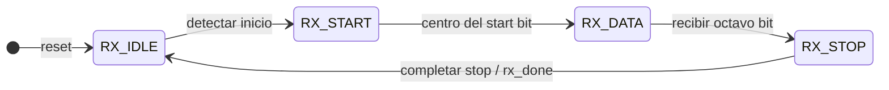
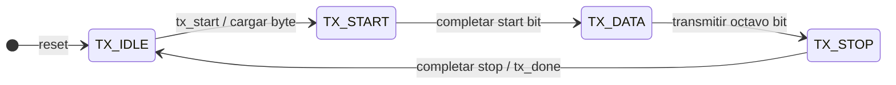
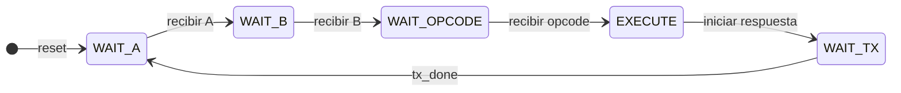
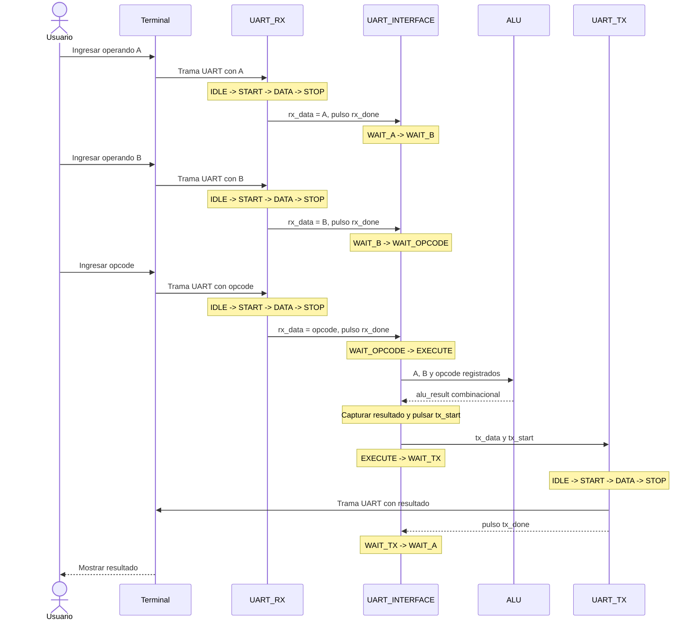
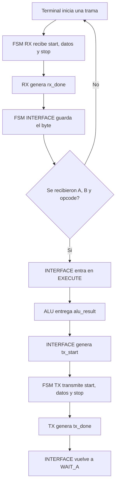

# Veriverilady

Proyecto de Arquitectura de Computadoras para integrar una ALU con comunicacion
UART sobre una placa Basys 3 con FPGA Artix-7. Una terminal en la notebook envia
los operandos y el codigo de operacion; la FPGA devuelve el resultado por UART.

## Arquitectura acordada

La primera version utiliza un protocolo transaccional de peticion-respuesta:

1. La terminal envia `op_A` en una trama UART.
2. La terminal envia `op_B` en una segunda trama UART.
3. La terminal envia `op_CODE` en una tercera trama UART.
4. La interface entrega los tres valores a la ALU.
5. La FPGA transmite un byte con el resultado.
6. La terminal espera ese resultado antes de comenzar el comando siguiente.

El transporte UART dispone de lineas RX y TX independientes, pero esta primera
version no superpone comandos. La interface ignora nuevos bytes mientras espera
que termine la respuesta actual.

No se incluyen FIFO ni timeout en hardware. La velocidad de la logica interna es
mucho mayor que la velocidad de llegada de los bytes, y el protocolo permite un
solo comando pendiente.

El modulo `top` integra el camino completo. Un Clocking Wizard generado en
Vivado convierte el clock de 100 MHz de la Basys 3 en el clock interno de 50 MHz
y entrega la senal `locked`. La logica secuencial permanece reseteada hasta que
ese clock se encuentra estable.

Si el opcode recibido no corresponde a una operacion implementada, la ALU
conserva su valor predeterminado y devuelve cero.

## Diagramas de bloques

El camino funcional y la distribucion temporal se muestran por separado para
evitar cruces entre senales que cumplen objetivos diferentes. Los diagramas se
mantienen como fuentes editables de Draw.io y se exportan a SVG para mostrarlos
en este documento.

### Camino de datos y control


[Fuente editable en Draw.io](docs/diagrams/uart_alu_data_control.drawio)

Las lineas azules continuas representan datos o buses. Las lineas magenta
discontinuas representan pulsos de control. Cada senal posee un puerto separado
y las flechas indican su direccion.

### Distribucion de clock, reset y tick


[Fuente editable en Draw.io](docs/diagrams/uart_clock_reset_tick.drawio)

La ALU no aparece en el segundo diagrama porque es combinacional: no recibe
`clk`, `reset` ni `tick`.

### Responsabilidad de cada modulo

| Modulo | Responsabilidad | Tiene FSM |
| --- | --- | --- |
| `clk_wiz_0` | Convierte los 100 MHz de la placa en 50 MHz e informa la estabilizacion mediante `locked`. | No; es un IP de Vivado basado en PLL. |
| `baud_rate_gen` | Divide el clock para generar el tick de sobremuestreo usado por RX y TX. | No; utiliza un contador. |
| `uart_rx` | Sincroniza la entrada asincrona, detecta una trama 8N1 y reconstruye un byte. | Si: `IDLE`, `START`, `DATA`, `STOP`. |
| `uart_interface` | Interpreta los bytes como A, B y opcode; controla la ALU y solicita la respuesta por TX. | Si: `WAIT_A`, `WAIT_B`, `WAIT_OPCODE`, `EXECUTE`, `WAIT_TX`. |
| `alu` | Calcula el resultado a partir de A, B y opcode. | No; es combinacional. |
| `uart_tx` | Captura un byte y lo convierte en una trama UART 8N1. | Si: `IDLE`, `START`, `DATA`, `STOP`. |
| `fsm_generic` | Implementa el registro de estado usado por las FSM de RX, TX e Interface. | No define transiciones; solamente registra `next_state`. |
| `top` | Integra clock, reset, BaudRateGen, RX, Interface, ALU y TX. | No; contiene interconexion y el sincronizador de reset. |

RX, TX e Interface instancian `fsm_generic`, pero cada uno posee su propia FSM.
Cada modulo calcula su `next_state` y utiliza una instancia diferente del
registro de estado.

## Senales entre modulos

| Senal | Origen | Destino | Significado |
| --- | --- | --- | --- |
| `clk_50MHz` | Clocking Wizard | BaudRateGen, RX, Interface y TX | Clock interno comun del sistema. |
| `clock_locked` | Clocking Wizard | Logica de reset del top | Indica que el clock interno ya es estable. |
| `reset_50MHz` | Sincronizador del top | BaudRateGen, RX, Interface y TX | Reset interno con liberacion sincronizada. |
| `baud_tick` | `baud_rate_gen` | RX y TX | Pulso que marca un periodo de sobremuestreo. |
| `rx_data[7:0]` | RX | Interface | Ultimo byte reconstruido por el receptor. |
| `rx_done` | RX | Interface | Pulso de un clock que indica que `rx_data` esta completo. |
| `alu_data_A[7:0]` | Interface | ALU | Primer operando registrado. |
| `alu_data_B[7:0]` | Interface | ALU | Segundo operando registrado. |
| `alu_op[5:0]` | Interface | ALU | Codigo de operacion registrado. |
| `alu_result[7:0]` | ALU | Interface | Resultado combinacional. |
| `tx_data[7:0]` | Interface | TX | Byte de respuesta que debe serializarse. |
| `tx_start` | Interface | TX | Pulso de un clock que inicia una transmision. |
| `tx_done` | TX | Interface | Pulso de un clock que indica el final de la trama. |

## Maquina de estados de UART RX

La entrada `rx` pasa primero por un sincronizador de dos flip-flops. La FSM
trabaja sobre la senal sincronizada y utiliza 16 ticks por bit.


```mermaid
stateDiagram-v2
    direction LR
    [*] --> RX_IDLE: reset
    RX_IDLE --> RX_START: detectar inicio
    RX_START --> RX_DATA: centro del start bit
    RX_DATA --> RX_STOP: recibir octavo bit
    RX_STOP --> RX_IDLE: completar stop / rx_done
```

### Acciones de UART RX

Si no se cumple la condicion de salida indicada en la tabla, la FSM permanece en
el mismo estado.

| Estado | Trabajo dentro del estado | Condicion de salida | Estado siguiente |
| --- | --- | --- | --- |
| `RX_IDLE` | Mantiene los contadores en reposo y observa `rx_sync`. | `rx_sync == 0`. | `RX_START` |
| `RX_START` | Incrementa `tick_count` solamente cuando llega `tick`. | `tick && mid_tick`, luego limpia `tick_count` y `bit_count`. | `RX_DATA` |
| `RX_DATA` | Cada `bit_tick` desplaza `rx_sync` dentro de `data_reg`, LSB primero. | `tick && bit_tick && last_bit`. | `RX_STOP` |
| `RX_STOP` | Cuenta 16 ticks correspondientes al stop bit. | `tick && bit_tick`, genera `rx_done`. | `RX_IDLE` |

El RTL actual no vuelve a comprobar que `rx_sync` siga en cero al llegar al
centro del start bit y tampoco verifica que la linea permanezca en uno durante
el stop bit. Por lo tanto, todavia no rechaza falsos inicios ni genera una senal
de error de framing.

## Maquina de estados de UART TX

UART TX captura `tx_data` cuando recibe `tx_start`. Luego mantiene cada simbolo
de la trama durante 16 ticks.


```mermaid
stateDiagram-v2
    direction LR
    [*] --> TX_IDLE: reset
    TX_IDLE --> TX_START: tx_start / cargar byte
    TX_START --> TX_DATA: completar start bit
    TX_DATA --> TX_STOP: transmitir octavo bit
    TX_STOP --> TX_IDLE: completar stop / tx_done
```

### Acciones de UART TX

Si no se cumple la condicion de salida indicada en la tabla, la FSM permanece en
el mismo estado.

| Estado | Salida `tx` | Trabajo dentro del estado | Condicion de salida | Estado siguiente |
| --- | --- | --- | --- | --- |
| `TX_IDLE` | `1` | Espera `tx_start`. Cuando llega, captura `tx_data` y limpia los contadores. | `tx_start == 1`. | `TX_START` |
| `TX_START` | `0` | Mantiene el start bit durante 16 ticks. | `tick && bit_tick`. | `TX_DATA` |
| `TX_DATA` | `data_reg[0]` | Mantiene cada bit durante 16 ticks y desplaza el registro, LSB primero. | `tick && bit_tick && last_bit`. | `TX_STOP` |
| `TX_STOP` | `1` | Mantiene el stop bit durante 16 ticks. | `tick && bit_tick`, genera `tx_done`. | `TX_IDLE` |

## Maquina de estados de UART INTERFACE

Esta FSM implementa la arquitectura acordada para la interface y coordina una
sola transaccion pendiente.


```mermaid
stateDiagram-v2
    direction LR
    [*] --> WAIT_A: reset
    WAIT_A --> WAIT_B: recibir A
    WAIT_B --> WAIT_OPCODE: recibir B
    WAIT_OPCODE --> EXECUTE: recibir opcode
    EXECUTE --> WAIT_TX: iniciar respuesta
    WAIT_TX --> WAIT_A: tx_done
```

### Acciones de UART INTERFACE

Si no se cumple la condicion de salida indicada en la tabla, la FSM permanece en
el mismo estado. `EXECUTE` es el unico estado que avanza sin esperar una senal
externa.

| Estado | Dato esperado | Accion | Condicion de salida | Estado siguiente |
| --- | --- | --- | --- | --- |
| `WAIT_A` | Primer byte | Al recibir `rx_done`, guarda `rx_data` en el registro A. | `rx_done == 1`. | `WAIT_B` |
| `WAIT_B` | Segundo byte | Al recibir `rx_done`, guarda `rx_data` en el registro B. | `rx_done == 1`. | `WAIT_OPCODE` |
| `WAIT_OPCODE` | Tercer byte | Al recibir `rx_done`, guarda `rx_data[5:0]` en el registro opcode. | `rx_done == 1`. | `EXECUTE` |
| `EXECUTE` | Ninguno | Prepara la captura de `alu_result` en `tx_data` y el pulso registrado `tx_start`. | Incondicional luego de un ciclo. | `WAIT_TX` |
| `WAIT_TX` | Ninguno | Conserva los registros y no acepta un comando nuevo. | `tx_done == 1`. | `WAIT_A` |

El estado `EXECUTE` separa el registro del opcode del inicio de TX. De esta forma,
la ALU dispone de un ciclo completo para propagar el resultado correspondiente a
las tres entradas ya registradas. En el flanco que cambia a `WAIT_TX`, `tx_data`
captura el resultado y `tx_start` pasa a uno. Durante el primer ciclo de
`WAIT_TX`, el valor predeterminado de `next_tx_start` prepara su retorno a cero.

## Secuencia completa de una operacion


```mermaid
sequenceDiagram
    actor USER as Usuario
    participant TERM as Terminal
    participant RX as UART_RX
    participant IF as UART_INTERFACE
    participant ALU as ALU
    participant TX as UART_TX

    USER->>TERM: Ingresar operando A
    TERM->>RX: Trama UART con A
    Note over RX: IDLE -> START -> DATA -> STOP
    RX->>IF: rx_data = A, pulso rx_done
    Note over IF: WAIT_A -> WAIT_B

    USER->>TERM: Ingresar operando B
    TERM->>RX: Trama UART con B
    Note over RX: IDLE -> START -> DATA -> STOP
    RX->>IF: rx_data = B, pulso rx_done
    Note over IF: WAIT_B -> WAIT_OPCODE

    USER->>TERM: Ingresar opcode
    TERM->>RX: Trama UART con opcode
    Note over RX: IDLE -> START -> DATA -> STOP
    RX->>IF: rx_data = opcode, pulso rx_done
    Note over IF: WAIT_OPCODE -> EXECUTE

    IF->>ALU: A, B y opcode registrados
    ALU-->>IF: alu_result combinacional
    Note over IF: Capturar resultado y pulsar tx_start

    IF->>TX: tx_data y tx_start
    Note over IF: EXECUTE -> WAIT_TX
    Note over TX: IDLE -> START -> DATA -> STOP
    TX->>TERM: Trama UART con resultado
    TX-->>IF: pulso tx_done
    Note over IF: WAIT_TX -> WAIT_A
    TERM-->>USER: Mostrar resultado
```

## Relacion temporal entre las FSM

Las tres FSM no avanzan al mismo tiempo de manera permanente. Cada una se activa
por eventos diferentes:


```mermaid
flowchart TD
    A["Terminal inicia una trama"] --> B["FSM RX recibe start, datos y stop"]
    B --> C["RX genera rx_done"]
    C --> D["FSM INTERFACE guarda el byte"]
    D --> E{"Se recibieron A, B y opcode?"}
    E -->|No| A
    E -->|Si| F["INTERFACE entra en EXECUTE"]
    F --> G["ALU entrega alu_result"]
    G --> H["INTERFACE genera tx_start"]
    H --> I["FSM TX transmite start, datos y stop"]
    I --> J["TX genera tx_done"]
    J --> K["INTERFACE vuelve a WAIT_A"]
```

## Reset del sistema

El Clocking Wizard funciona continuamente y no utiliza el reset funcional del
protocolo. El top combina el pulsador activo en alto con el estado del PLL:

```text
reset_request = reset OR NOT clock_locked
```

Una cadena de dos flip-flops realiza asercion asincrona y liberacion sincronizada
con `clk_50MHz`. De esta forma, los modulos comienzan a trabajar juntos dos
flancos despues de que desaparece `reset_request`.

Al activar el reset:

- UART RX vuelve a `RX_IDLE` y limpia sus contadores y registro de datos.
- UART TX vuelve a `TX_IDLE`, limpia sus contadores y deja la linea en reposo.
- UART INTERFACE vuelve a `WAIT_A` y limpia A, B, opcode, `tx_data` y `tx_start`.
- `baud_rate_gen` reinicia su contador.
- La ALU no necesita reset porque no contiene estado interno.

El sincronizador implementado garantiza una liberacion alineada con el clock,
pero no implementa un filtro de rebote dedicado para el pulsador. Un rebote puede
prolongar o volver a activar el reset, sin afectar al Clocking Wizard.

## Configuracion temporal

| Propiedad | Valor |
| --- | --- |
| Clock fisico de la Basys 3 | 100 MHz |
| Clock interno generado | 50 MHz |
| Formato UART | 8N1 |
| Baudrate nominal | 19200 baud |
| Sobremuestreo | 16 ticks por bit |
| Divisor entero actual | 162 ciclos por tick |
| Baudrate efectivo aproximado | 19290 baud |
| Error respecto del valor nominal | `+0,47 %` |

La division entera de `baud_rate_gen` trunca `162,76` a `162`. Se acepta este
error para la primera prueba fisica porque permanece dentro del margen practico
esperado para una trama UART 8N1. RX y TX comparten el mismo `baud_tick`.

## Justificacion de no utilizar FIFO

Con una configuracion 8N1 a 19200 baud, cada byte ocupa aproximadamente 521 us.
La interface necesita solamente uno o pocos ciclos de clock para registrar cada
byte. Ademas, la terminal espera el resultado antes de iniciar otro comando.

Por estas razones no existe acumulacion de datos pendiente y una FIFO no aporta
una funcion necesaria en esta primera version. Podria agregarse posteriormente
si el protocolo permitiera multiples comandos pendientes o procesamiento en
streaming.

## Verificacion

| Testbench | Alcance | Resultado |
| --- | --- | --- |
| `baud_rate_gen_tb.v` | Generacion periodica del tick. | Simulacion unitaria superada. |
| `uart_rx_tb.v` | Recepcion y reconstruccion de una trama 8N1. | Simulacion unitaria superada. |
| `uart_tx_tb.v` | Serializacion de un byte en una trama 8N1. | Simulacion unitaria superada. |
| `uart_interface_tb.v` | Flujo esencial A, B, opcode, resultado y nueva operacion. | 8 verificaciones superadas. |
| `top_tb.v` | Clocking Wizard, `locked`, reset sincronizado y operacion ADD punta a punta. | Simulacion de integracion superada en Vivado/XSim. |

La prueba de integracion envia por `rx` los bytes `8'h15`, `8'h03` y `8'h20`.
La ALU ejecuta ADD y la terminal simulada reconstruye `8'h18` desde la linea
serie `tx`. La simulacion tambien confirma un periodo interno de 20 ns y la
liberacion del reset en dos flancos de `clk_50MHz`.

## Estado de implementacion

| Componente | Estado |
| --- | --- |
| Clocking Wizard | Generado en Vivado: 100 MHz a 50 MHz con salida `locked`. |
| `baud_rate_gen.v` | Implementado y probado individualmente. |
| `uart_rx.v` | Implementado y probado individualmente. |
| `uart_tx.v` | Implementado y probado individualmente. |
| `fsm_generic.v` | Implementado y utilizado por RX, TX e Interface. |
| `alu.v` | Implementado y ejercitado por la simulacion de integracion. |
| `uart_interface.v` | Implementado y probado con su flujo esencial. |
| `top.v` | Implementado, sintetizado e implementado correctamente en Vivado. |
| `top_tb.v` | Implementado y simulado correctamente en Vivado/XSim. |
| `constraints.xdc` | Incorporado con clock, reset y pines del puente USB-UART. |
| Bitstream/binario | Generado y listo para programar la Basys 3. |
| Programa de terminal | Pendiente; se implementara como script Python. |
| Prueba fisica UART | Pendiente hasta disponer del script de terminal. |

## Proximos pasos

1. Implementar un script Python que abra el puerto serie a 19200 baud, 8N1 y sin
   control de flujo.
2. Enviar tres bytes binarios en orden: A, B y opcode. No deben enviarse sus
   representaciones ASCII.
3. Leer exactamente un byte de respuesta con un timeout de software y mostrar
   el resultado en la terminal.
4. Programar la Basys 3 con el binario ya generado y validar fisicamente el
   recorrido completo.
