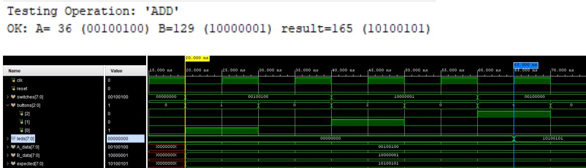
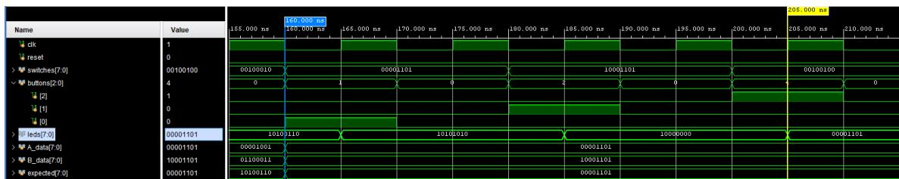
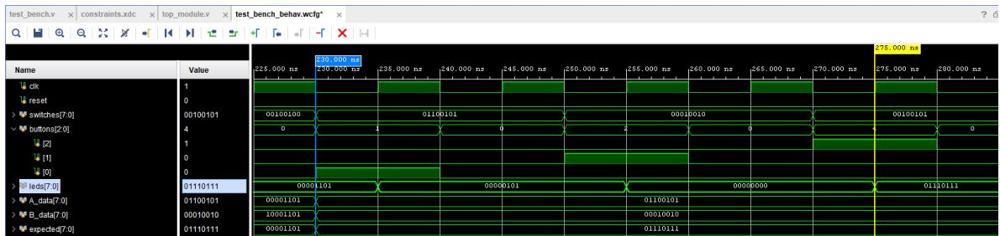
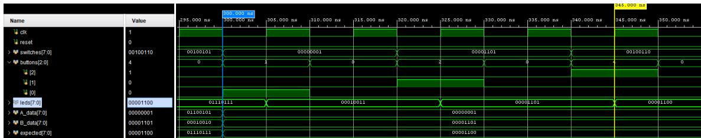
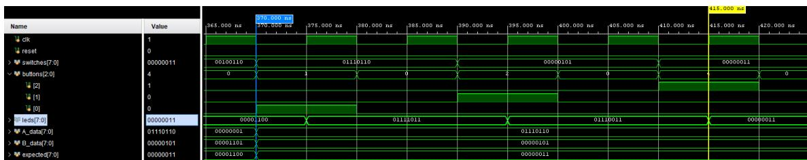
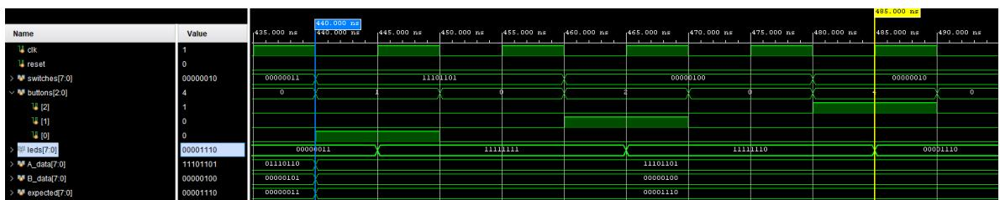
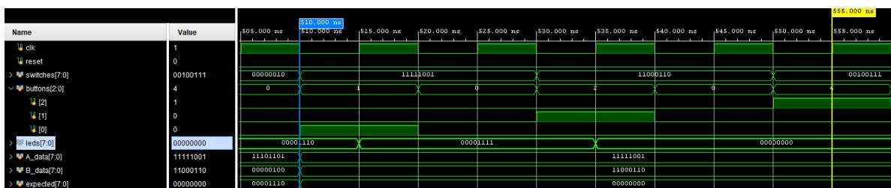

## Funcionamiento del testbench

El testbench verifica las ocho operaciones implementadas por la ALU: `ADD`, `SUB`, `AND`, `OR`, `XOR`, `SRA`, `SRL` y `NOR`. Para cada prueba genera operandos de 8 bits, calcula el resultado esperado y los carga secuencialmente en el módulo `top_module` mediante los switches y los botones. Los registros internos `A_reg`, `B_reg` y `OP_reg` toman sus valores en los flancos ascendentes del reloj, mientras que la ALU actualiza la salida `leds` de forma combinacional. En las operaciones de desplazamiento, el valor de `B_data` se limita al rango de 0 a 7 bits.

### Secuencia temporal de la primera prueba

| Intervalo / instante | Acción |
|---:|:---|
| **0–10 ns** | Se mantiene `reset = 1`. En el flanco ascendente de **5 ns**, los registros `A_reg`, `B_reg` y `OP_reg` se inicializan en cero. |
| **10–20 ns** | Se desactiva el reset y se espera un ciclo de reloj antes de iniciar las pruebas. |
| **20 ns** | Se generan `A_data` y `B_data` de forma aleatoria y se calcula `expected`. Como son asignaciones sin retardo, ocurren en el mismo instante de simulación. |
| **20–30 ns** | Se coloca `A_data` en `switches` y se activa `buttons[0]`. El operando queda almacenado en `A_reg` en el flanco de **25 ns**. |
| **30–40 ns** | Se desactiva `buttons[0]` antes de cargar el siguiente operando. |
| **40–50 ns** | Se coloca `B_data` en `switches` y se activa `buttons[1]`. El operando queda almacenado en `B_reg` en el flanco de **45 ns**. |
| **50–60 ns** | Se desactiva `buttons[1]` antes de cargar el código de operación. |
| **60–70 ns** | Se coloca el opcode en los 6 bits menos significativos de `switches` y se activa `buttons[2]`. El código queda almacenado en `OP_reg` en el flanco de **65 ns**. |
| **65 ns** | La ALU combinacional evalúa `A_reg`, `B_reg` y `OP_reg`; el resultado se refleja en `leds`. |
| **70–90 ns** | Se desactiva `buttons[2]`, se espera la propagación de la salida y, a los **90 ns**, se compara `leds` con `expected`. |

La tarea `run_test` dura **70 ns**, por lo que, con `NUM_TESTS = 1`, una nueva operación comienza cada 70 ns a partir de los 20 ns.

     
    <em>Fig 1. Operacion ADD en la ALU.</em>

     
    <em>Fig 2. Operacion SUB en la ALU.</em>

     
    <em>Fig 3. Operacion AND en la ALU.</em>

     
    <em>Fig 4. Operacion OR en la ALU.</em>

     
    <em>Fig 5. Operacion XOR en la ALU.</em>

     
    <em>Fig 6. Operacion SRA en la ALU.</em>

     
    <em>Fig 7. Operacion SRL en la ALU.</em>

     
    <em>Fig 8. Operacion NOR en la ALU.</em>

